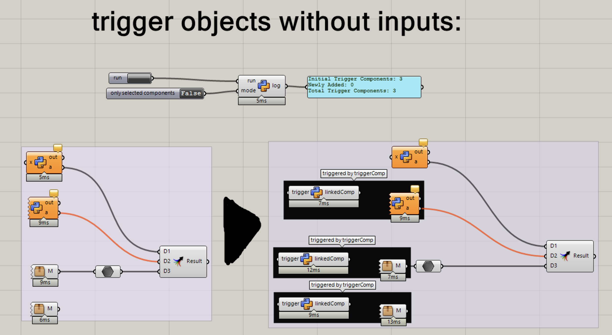

# Grasshopper Trigger Component Creator

## Description
This Grasshopper script dynamically creates trigger components in Rhino's Grasshopper environment. The main function of these triggers is to allow components with no inputs to be expired and recomputed, which isn't directly possible in Grasshopper. The script searches for components with no inputs and automatically attaches a trigger to them.

## Features
- **Automatic Detection:** Detects components without inputs, either from the entire canvas or just from selected ones.
- **Trigger Creation:** Generates Python-based trigger components and links them to the target components.
- **Feedback:** Provides feedback on the number of trigger components initially present, the number added, and the total.
- **Organization:** Groups the target and the newly created trigger for better visualization and clarity.

## Usage
1. Place the provided Python component in the Grasshopper canvas.
2. Set the `mode` to determine the scope: `True` for selected components only or `False` for all components.
3. Run the script.
4. The log will indicate the initial count of trigger components, how many new triggers were added, and the total.
